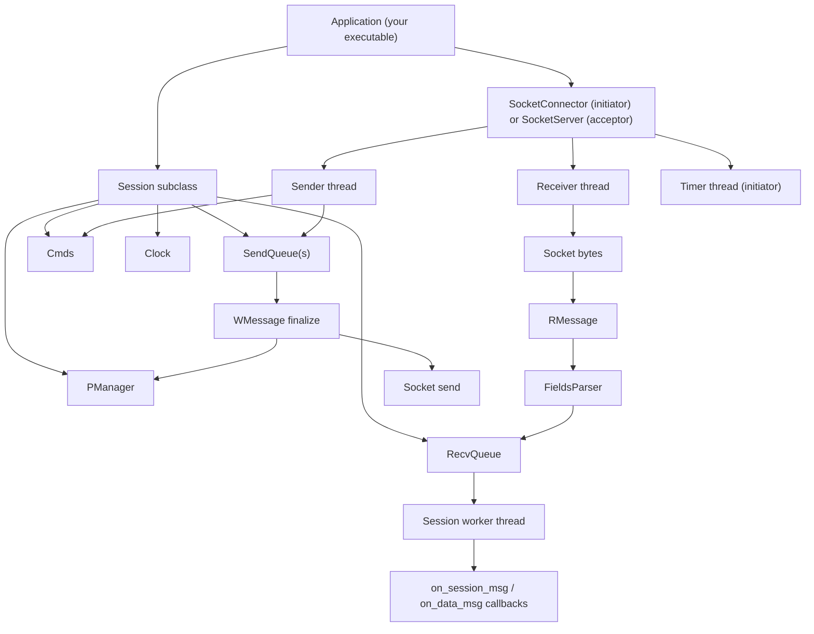
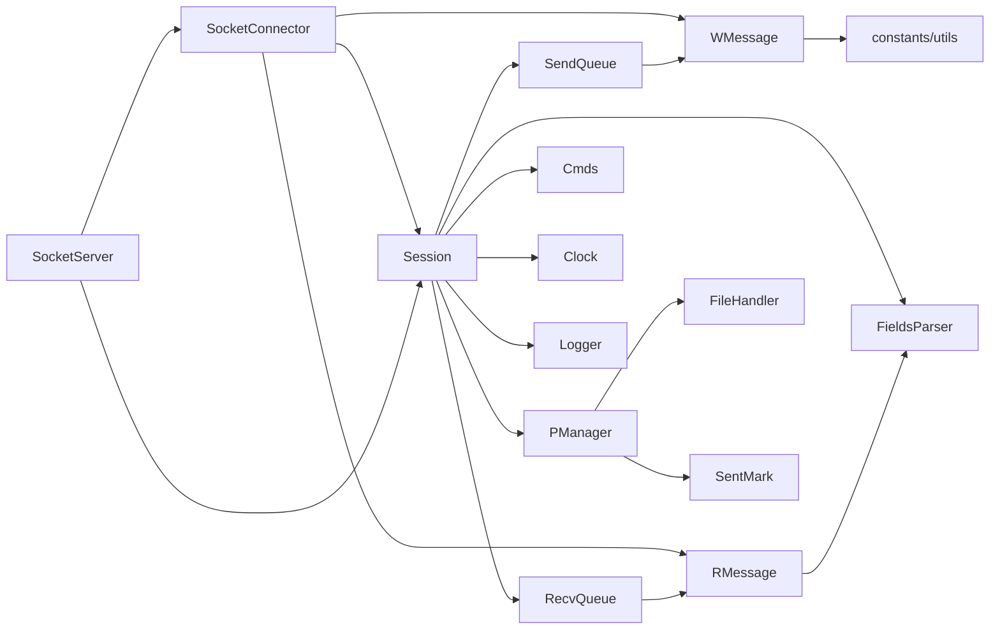

# ufix

`ufix` is a C++ static library for building FIX engines used by trading platforms.
It provides session handling, socket transport, message parsing/building, queueing,
persistence, resend/recovery, and logging primitives.

This repository is primarily a library codebase.
An executable sample is included at [`examples/main.cpp`](./examples/main.cpp).

## Key Capabilities

- FIX session lifecycle: logon, heartbeat, test request, resend request, sequence reset.
- Initiator and acceptor connection models.
- Non-blocking socket send/recv with dedicated threads.
- Outgoing queue persistence and restart recovery.
- Incoming sequence ordering with automatic resend request on gaps.
- Platform abstraction for POSIX and Windows in `portable.h`.

## Repository Layout

- Session core
  - [`Session.h`](./Session.h), [`Session.cpp`](./Session.cpp)
  - [`SessionOption.h`](./SessionOption.h), [`SessionOption.cpp`](./SessionOption.cpp)
  - [`Cmds.h`](./Cmds.h), [`Cmds.cpp`](./Cmds.cpp)
  - [`Clock.h`](./Clock.h), [`Clock.cpp`](./Clock.cpp)
  - [`Locker.h`](./Locker.h), [`Locker.cpp`](./Locker.cpp)
- Transport
  - [`SocketConnector.h`](./SocketConnector.h), [`SocketConnector.cpp`](./SocketConnector.cpp)
  - [`SocketServer.h`](./SocketServer.h), [`SocketServer.cpp`](./SocketServer.cpp)
- Message model and parsing
  - [`WMessage.h`](./WMessage.h), [`WMessage.cpp`](./WMessage.cpp)
  - [`RMessage.h`](./RMessage.h), [`RMessage.cpp`](./RMessage.cpp)
  - [`FieldsParser.h`](./FieldsParser.h), [`FieldsParser.cpp`](./FieldsParser.cpp)
  - [`RGroups.h`](./RGroups.h), [`RGroups.cpp`](./RGroups.cpp)
  - [`Group.h`](./Group.h), [`Group.cpp`](./Group.cpp)
  - [`RGroupsDictionary.h`](./RGroupsDictionary.h), [`RGroupsDictionary.cpp`](./RGroupsDictionary.cpp)
- Queueing and persistence
  - [`SendQueue.h`](./SendQueue.h), [`SendQueue.cpp`](./SendQueue.cpp)
  - [`RecvQueue.h`](./RecvQueue.h), [`RecvQueue.cpp`](./RecvQueue.cpp)
  - [`PManager.h`](./PManager.h), [`PManager.cpp`](./PManager.cpp)
  - [`SentMark.h`](./SentMark.h), [`SentMark.cpp`](./SentMark.cpp)
  - [`FileHandler.h`](./FileHandler.h), [`FileHandler.cpp`](./FileHandler.cpp)
- Logging and utilities
  - [`Logger.h`](./Logger.h), [`Logger.cpp`](./Logger.cpp)
  - [`SimpleLogger.h`](./SimpleLogger.h), [`SimpleLogger.cpp`](./SimpleLogger.cpp)
  - [`constants.h`](./constants.h), [`utils.h`](./utils.h), [`utils.cpp`](./utils.cpp), [`portable.h`](./portable.h)

## Runtime Thread Flow

### Initiator mode (client side)

1. Create a `Session` subclass instance and a `SocketConnector(session)`.
2. Call `SocketConnector::start()` to launch:
   - `RC-*` receiver thread (`recv_msgs`)
   - `SD-*` sender thread (`send_msgs`)
   - `TM-*` timer thread (`keep_update_utc_time`) for initiator mode
3. Call `session.start()` to launch the session worker thread (`process_recv_queue_msgs`),
   which dispatches parsed messages to your callbacks.

### Acceptor mode (server side)

1. Create a `SocketServer`.
2. Register one or more sessions with `add_session(...)`.
3. Call `SocketServer::start()`.
4. The server accept thread waits for inbound TCP connections.
5. For each accepted socket, a connection handler thread:
   - reads the first FIX message
   - identifies the target session from `SenderCompID`/`TargetCompID`
   - builds `SocketConnector(tempBuf, socket, session)`
   - starts recv/send processing for that connection

## End-to-End Flowchart



## File Relationship Map (High-Level Dependencies)



## Build

The project builds a static library: `libufix.a`.

### POSIX/Linux (using makefile)

```bash
make lib
```

Current `makefile` target `all` does:

1. build `libufix.a`
2. install library/headers into fixed system paths
3. clean object files

```bash
make all
```

Default install paths in [`makefile`](./makefile):

- `LIB_TARGET=/octech/lib/octech/cpp`
- `LIB_INCLUDE=/octech/lib/octech/include/fix`

### Windows (MinGW, without make)

If `make` is unavailable on Windows, build manually:

```powershell
Get-ChildItem -Filter *.cpp | ForEach-Object {
  g++ -g -c -Wall -Wno-non-virtual-dtor -I./ -D_WINDOWS_OS_ $_.Name -o ($_.BaseName + ".o")
}
ar rcs libufix.a *.o
```

## How to Use in Your Own App

This repository does not provide a production executable.
Build your own executable and link against `libufix.a`.

1. Derive a class from `ufix::Session`.
2. Implement:
   - `ready_for_data()`
   - `pre_process_msg(RMessage*)`
   - `on_session_msg(RMessage*)`
   - `on_data_msg(RMessage*)`
3. Fill `SessionOption` (`fix_version`, comp IDs, heartbeat, queue sizes, persistence directory, and related settings).
4. Pick one runtime model:
   - Initiator: use `SocketConnector(session)`, set host/port, then call `start()`.
   - Acceptor: use `SocketServer`, register sessions, then call `start()`.
5. Start asynchronous session dispatch by calling `session.start()`.

## Minimal Example App

An executable example is already included in this repository:

- [`examples/main.cpp`](./examples/main.cpp)

### Build and run the example (POSIX/Linux)

1. Build the ufix static library:
   ```bash
   make lib
   ```

2. Compile and link the included example from repository root:
   ```bash
   g++ -std=c++11 -O2 -D_POSIX_ -I. examples/main.cpp ./libufix.a -lpthread -o app
   ```

3. Run acceptor in terminal A:
   ```bash
   ./app acceptor
   ```

4. Run initiator in terminal B:
   ```bash
   ./app initiator
   ```

5. Check generated logs and persistence files:
   - `data/`
   - `session.log` files created by `PManager`/`Logger`

### Build and run the example (Windows MinGW)

1. Build the static library manually:
   ```powershell
   Get-ChildItem -Filter *.cpp | ForEach-Object {
     g++ -g -c -Wall -Wno-non-virtual-dtor -I./ -D_WINDOWS_OS_ $_.Name -o ($_.BaseName + ".o")
   }
   ar rcs libufix.a *.o
   ```

2. Build the sample app:
   ```powershell
   g++ -std=c++11 -O2 -D_WINDOWS_OS_ -I. examples/main.cpp .\libufix.a -lws2_32 -o app.exe
   ```

3. Run two terminals:
   ```powershell
   .\app.exe acceptor
   ```
   ```powershell
   .\app.exe initiator
   ```

4. Validate logs under `data/`:
   - `data/SERVER1-CLIENT1/session.log` (initiator side)
   - `data/CLIENT1-SERVER1/session.log` (acceptor side)

## Test Procedure

Use this smoke test to validate connection + session bootstrap:

1. Build `libufix.a`.
2. Build `app` / `app.exe` from [`examples/main.cpp`](./examples/main.cpp).
3. Start `acceptor` first.
4. Start `initiator`.
5. Wait 5-10 seconds.
6. Confirm in both logs:
   - `35=A` (Logon) messages exchanged.
   - Session reaches state `31` (LOGON).
   - No `FATAL` entries.

## Latest Verified Result (2026-04-18)

Environment:
- Windows (PowerShell), MinGW-w64 `g++ 15.2.0`

Result:
- `libufix.a` built successfully.
- `examples/main.cpp` built successfully to `app.exe`.
- `acceptor` and `initiator` both ran concurrently.
- FIX logon handshake was observed in both session logs.
- Session reached `state = 31` in logs.

Evidence captured from local run:
- `data/SERVER1-CLIENT1/session.log`
- `data/CLIENT1-SERVER1/session.log`

## Notes and Operational Expectations

- Sequence and queue state are persisted by `PManager`.
- `RecvQueue` can enqueue resend requests when gaps are detected.
- `SendQueue` persists outgoing payloads and supports resend logic.
- `portable.h` controls platform-specific behavior (`_POSIX_` or `_WINDOWS_OS_`).
- `SimpleLogger` logs both session and data messages; you can supply a custom `Logger`.

## Current Scope

- Library components only (no sample app, integration tests, or benchmark scripts in this repo).
- Best used as a core transport/session layer embedded into a strategy/execution application.
